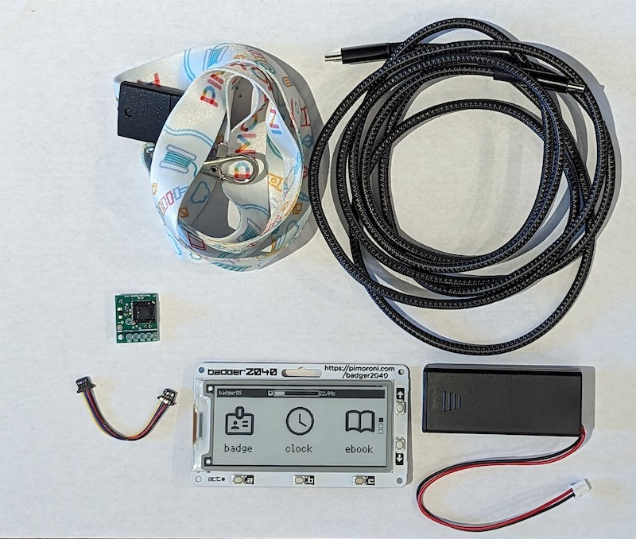
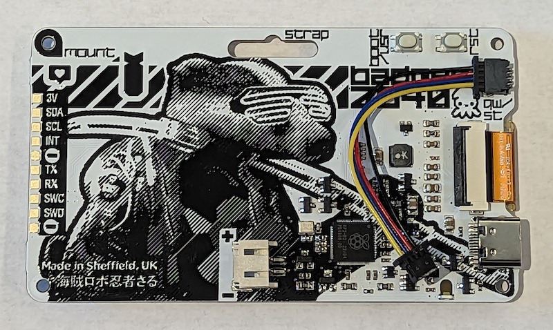
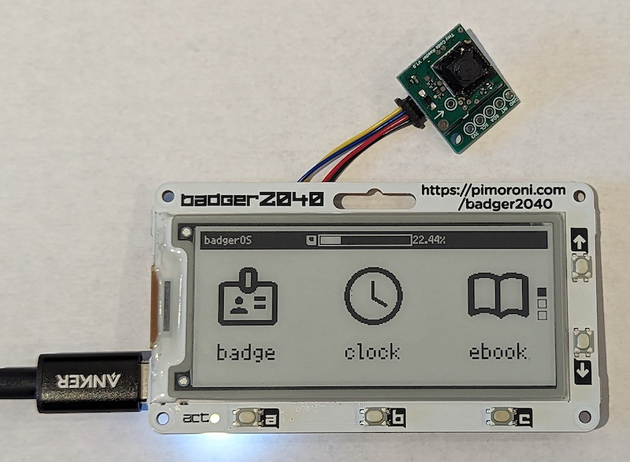
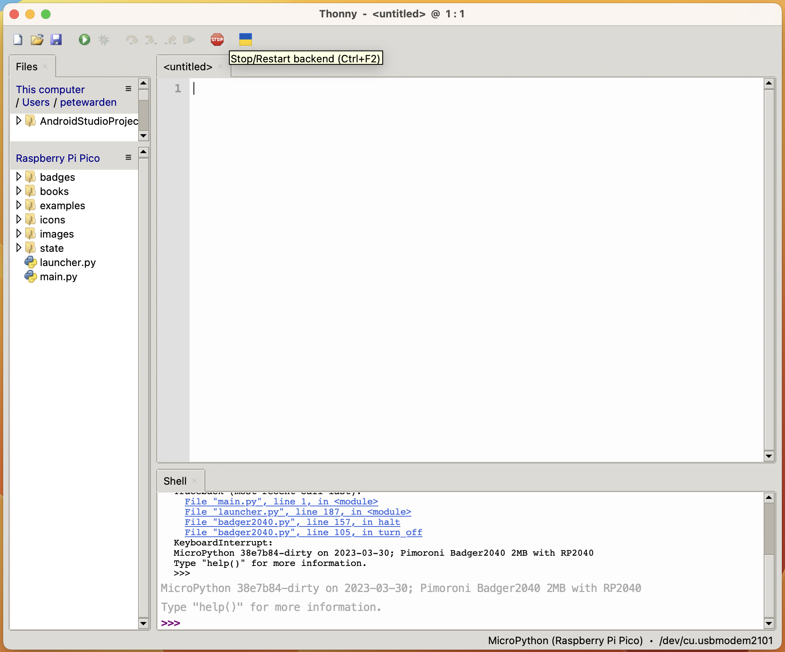
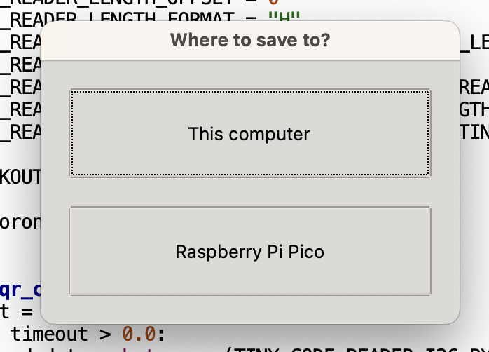

# Tiny Code Reader with the Badger 2040
How to use the Tiny Code Reader with the Pimoroni Badger 2040.

## Introduction

The Tiny Code Reader is a small hardware module that's intended to make it easy
to scan QR codes. It has an image sensor and a microcontroller with pretrained
software and outputs information from any identified codes over I2C.

There's a [detailed developer guide](https://usfl.ink/tcr_dev)
available, but this project has sample code that shows you specifically how to 
get the module up and running using MicroPython on Pimoroni's [Badger 2040 boards](https://shop.pimoroni.com/products/badger-2040?variant=39752959885395).

The reader and the badger make a great combination because the e-ink display is
capable of displaying QR codes which the TCR can then scan. This is an easy way
for badges to communicate with each other, so you can imagine conference badges
that can scan other badges of people you've met, making it easy to stay in touch
without needing to load an app on your phone to capture their information. I am
hoping there will be a lot of creative use cases too, I'd love to see real
world games where people can scan codes on objects or each other to advance and
explore.

## Setting Up

You'll need the following items to run this code:

 - [Badger 2040]((https://shop.pimoroni.com/products/badger-2040?variant=39752959885395) (Badger 2040W should also work, but hasn't been tested)
 - [Tiny Code Reader](https://usfl.ink/ps).
 - QWIIC to QWIIC cable.
 - USB C cable.

If you want to use the module as a badge away from your computer, you should also get a battery pack and lanyard from Pimoroni.

## Wiring

The Badger board has a QWIIC socket on the back, in the top left. Plug one end
of the QWIIC cable into that socket.

Attach the other end to the Tiny Code Reader, and then plug in the USB C cable
to the board and your laptop. You should see the LED on the reader start to
flash blue.

## Software

I recommend downloading [Thonny](https://thonny.org/) to your computer to edit
and run the MicroPython scripts this example uses. It's available for all major
operating systems.

You'll also need to download this repository. If you're comfortable with `git`
you can clone it from the command line, or you can [grab the latest version as a zip archive](https://github.com/usefulsensors/tiny_code_reader_badger/archive/refs/heads/main.zip).

## Running a Small Example

The Badger comes pre-loaded with BadgerOS, so we're going to modify that to
run our example instead of the default launcher. Open up the Thonny application
and make sure you see a `>>>>` prompt in the bottom tray. This indicates the
board is connected and we can access MicroPython. You'll also want to choose
`View->Files` in the menu so you can see the file system of the board.

In the file view, double click on `main.py` to load the default starting
program. We want to replace this with our own code, so delete the two lines
that are already in there. Then go to `minimal.py` in this repository and
copy and paste all the contents into the `main.py` program, and save it.
You'll be asked if you want to save to your computer or the Raspberry Pi Pico,
make sure you choose the Pico.

Once it has saved, press F5 or click the run button. If you then point the
reader at a QR code, you should see the contents of that code appear in the
bottom pane of the Thonny window.

## Running an Interactive Application

The low power consumption and e-ink display on the badger make it ideal for
jobs like conference badges, meeting room displays, or toys. The `qr_scanner.py`
script shows how an application like that could work. If you point it at a QR
code and press the A button, it will scan and display the text contents, and the
code itself on the badge display. It can scan from phones, laptops, paper, or other Badger e-ink displays, so you can easily pass around complex information
with just a button press.

To run the application, first create a new file in Thonny named 
`read_qr_code.py`. Copy the contents of the file with the same name in this
folder into it. Then copy the contents of `qr_scanner.py` into the `main.py`
file, like you did with the `minimal.py` file contents in the simple example.

If you press Run in Thonny you should see the badge display show "Press A to
scan and display a QR code". If you then press A and point the reader at a QR
code, you should see the contents appear on the badge. Here's a video showing
how to use it in more detail:

